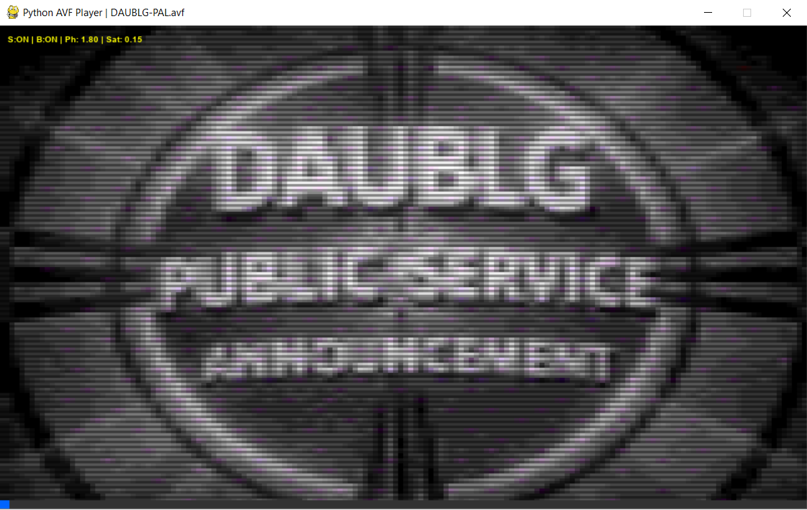
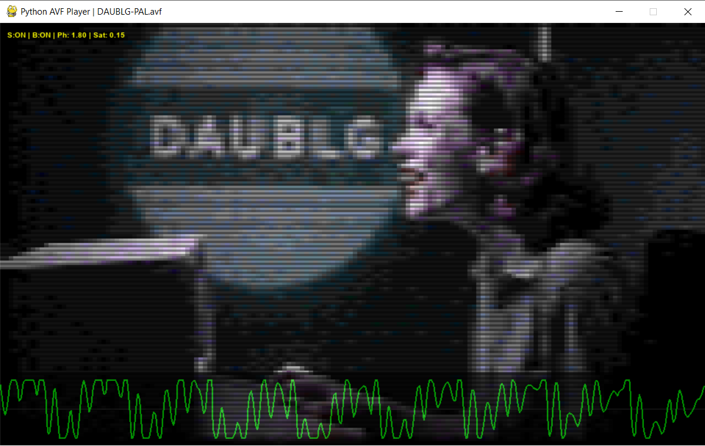

# AVFPlayer
A simple Python  AVF video file (Atari Video Format) player for modern computers.

## Why use this tool?

- To quickly check AVF files without need to launch real hardware.
- To debug output of [avi2atari](https://github.com/HanJammer/avfplayer).

### Key Features:

- Hardware-adaptive audio sync

- GTIA Palette emulation (YIQ/YUV colorspace)

- Real-time Phase/Saturation adjustment

- CRT Scanline emulation

- Horizontal Blending (Blur)

- Looped playback

## Installation

### The easy way (If you are Windows user and not sure what to do):

Open the Command Prompt, then:

    winget install Python.Python.3.10
    winget install Git.Git
    git clone https://github.com/HanJammer/avfplayer.git
    cd avfplayer
    python -m pip install -r requirements.txt
    python avfplayer.py

### The regular (recommended) way:

Install prerequisities:

**Python 3.10+**

Then:

1. **Clone the repository:**
    
    ```
    git clone https://github.com/HanJammer/avfplayer.git
    cd avfplayer
    ```
    
2. **Create a Virtual Environment (Recommended):**
    
    - **Windows (Command Prompt / PowerShell):**
        
        ```
        python -m venv venv
        .\venv\Scripts\activate
        ```
        
    - **Linux / macOS:**
        
        ```
        python3 -m venv venv
        source venv/bin/activate
        ```
        
3. **Install dependencies:**
      
    ```
    pip install -r requirements.txt
    ```

---

## Usage

Play video for PAL system:

```
python avfplayer.py video-PAL.mp4 --system PAL
or
python avfplayer.py video-PAL.mp4
```

Play video for NTSC system:

```
python avfplayer.py video-NTSC.mp4 --system NTSC
```

## Parameters

```
usage: avfplayer.py [-h] [--scale SCALE] [--debug] file [system]
```

| **Parameter**  | **Description**                                                                                                                                                                                       |
| -------------- | ----------------------------------------------------------------------------------------------------------------------------------------------------------------------------------------------------- |
| `file`         | Input AVF file                                                                                                                                                                                        |
| `system`       | Target system: `PAL` or `NTSC`. Default: `PAL`.                                                                                                                                                       |
| `--debug`      | Enables debug overlay (currently shows oscilloscope).                                                                                                                                                 |
| `--scale`      | Scale of the video window (integer number, 3 is default, 8 fits 4k screen).                                                                                                                           |

## In-player Controls

| **Key**             | **Description**                                                                                                                                                                                  |
| ------------------- | ------------------------------------------------------------------------------------------------------------------------------------------------------------------------------------------------ |
| `S`                 | Enable/Disable scanlines. Default: Enabled.                                                                                                                                                      |
| `B`                 | Enable/Disable pixel blending. Default: Enabled.                                                                                                                                                 |
| `[`/`]`             | Tune color phase in 0.05 steps.                                                                                                                                                                  |
| `Shift+[`/`Shift+]` | Scale of the video window (integer number, 3 is default, 8 fits 4k screen).                                                                                                                      |
| `L`                 | Loop video. Default: Disabled.                                                                                                                                                                   |
| `D`                 | Show/Hide oscilloscope. Default: Disabled                                                                                                                                                        |

### Output examples

**"DAUBLG Makes it Right!"** ([source video](https://www.youtube.com/watch?v=Pq7VeyPghbY)).

Download AVF: [PAL](https://drive.google.com/file/d/1xqwC5dUnTEuFpL4qeniVdj2TtK0Gm0vs/view?usp=sharing) [NTSC](https://drive.google.com/file/d/1UhUVOQMtQdMp4kDoz1Lhlnayg7lL8b0n/view?usp=sharing)

| **Sample 1**                                  | **Sample 2**                                  |
| ----------------------------------------------| --------------------------------------------- |
|  |  |

## Limitations

Don't expect the videos to have exactly the same colors as on original hardware. Built in are some basic controls for the Phase and Saturation but there will be some differences.

---

## Contributing

This tool was created to modernize the Atari 8-bit video ecosystem.

Testing and debugging was done on the PAL hardware only. NTSC is mostly untested - if you have NTSC computer and can test the output AVFs - this would be a great help to make this program better.

If you find bugs or have ideas for better dithering algorithms:

1. Fork the repo.
    
2. Create your feature branch.
    
3. Submit a Pull Request.

**Credits:**

- Coding & Engineering: HanJammer & Lumen.

- Additional ideas: MNEMOS.
