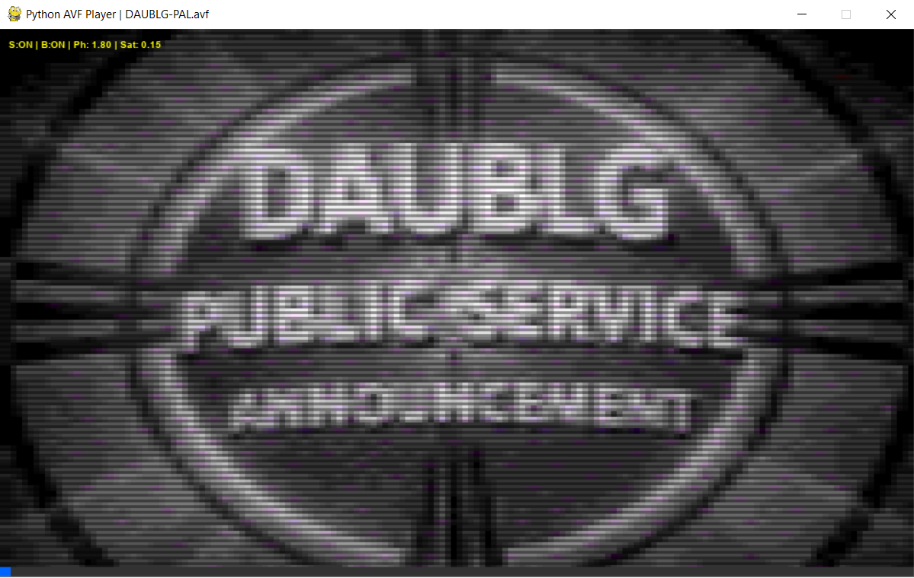
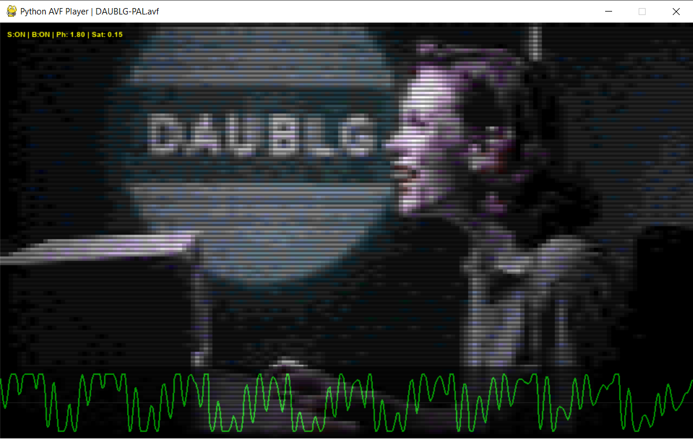

# AVFPlayer
A simple Python  AVF video file (Atari Video Format) player for modern computers.

## Why use this tool?

- To quickly check AVF files without need to launch real hardware.
- To debug output of [avi2atari](https://github.com/HanJammer/avi2atari).

### Key Features:

- Hardware-adaptive audio sync

- GTIA Palette emulation (YIQ/YUV colorspace)

- Real-time Phase/Saturation adjustment

- CRT (or rather player) scanline emulation

- Horizontal Blending (Blur)

- Looped playback

## Installation

### The easy way (If you are Windows user and not sure what to do):

Open the Command Prompt, then:

    winget install Python.Python.3.10
    winget install Git.Git
    git clone https://github.com/HanJammer/avfplayer.git
    cd avfplayer
    python -m pip install -r requirements.txt
    python avfplayer.py

### The regular (recommended) way:

Install prerequisities:

**Python 3.10+**

Then:

1. **Clone the repository:**
    
    ```
    git clone https://github.com/HanJammer/avfplayer.git
    cd avfplayer
    ```
    
2. **Create a Virtual Environment (Recommended):**
    
    - **Windows (Command Prompt / PowerShell):**
        
        ```
        python -m venv venv
        .\venv\Scripts\activate
        ```
        
    - **Linux / macOS:**
        
        ```
        python3 -m venv venv
        source venv/bin/activate
        ```
        
3. **Install dependencies:**
      
    ```
    pip install -r requirements.txt
    ```

---

## Usage

Play an AVF file for PAL system:

```
python avfplayer.py video-PAL.avf PAL
or
python avfplayer.py video-PAL.avf
```

Play an AVF file for NTSC system:

```
python avfplayer.py video-NTSC.avf NTSC
```

## Parameters

```
usage: avfplayer.py [-h] [--scale SCALE] [--debug] file [system]
```

| **Parameter**  | **Description**                                                                                                                                                                                       |
| -------------- | ----------------------------------------------------------------------------------------------------------------------------------------------------------------------------------------------------- |
| `file`         | Input AVF file                                                                                                                                                                                        |
| `system`       | Target system: `PAL` or `NTSC`. Default: read from the AVF2 header if present, otherwise `PAL`.                                                                                                       |
| `--info`       | Print AVF2 metadata (title, author, converter, duration, poster) and exit.                                                                                                                            |
| `--poster`     | Show the AVF2 poster frame before playback (any key starts; the tuning keys work there too).                                                                                                          |
| `--debug`      | Enables debug overlay (currently shows oscilloscope).                                                                                                                                                 |
| `--scale`      | Scale of the video window (integer number, 3 is default, 8 fits 4k screen).                                                                                                                           |

## In-player Controls

| **Key**             | **Description**                                                                                                                                                                                  |
| ------------------- | ------------------------------------------------------------------------------------------------------------------------------------------------------------------------------------------------ |
| `S`                 | Enable/Disable scanlines. Default: Enabled.                                                                                                                                                      |
| `B`                 | Enable/Disable pixel blending. Default: Enabled.                                                                                                                                                 |
| `[`/`]`             | Tune color phase (hue rotation) in 0.05 rad steps. Default: `0.00` = encoder-exact hues.                                                                                                         |
| `Shift+[`/`Shift+]` | Tune color saturation (chroma gain) in 0.05 steps. Default: `1.00` = the Atari's own chroma amplitude; try `~2.0` for source-like punch.                                                          |
| `L`                 | Loop video. Default: Disabled.                                                                                                                                                                   |
| `D`                 | Show/Hide oscilloscope. Default: Disabled                                                                                                                                                        |

### Output examples

**"DAUBLG Makes it Right!"** ([source video](https://www.youtube.com/watch?v=Pq7VeyPghbY)).

Download AVF: [PAL](https://drive.google.com/file/d/1xqwC5dUnTEuFpL4qeniVdj2TtK0Gm0vs/view?usp=sharing) [NTSC](https://drive.google.com/file/d/1UhUVOQMtQdMp4kDoz1Lhlnayg7lL8b0n/view?usp=sharing)

| **Sample 1**                                  | **Sample 2**                                  |
| ----------------------------------------------| --------------------------------------------- |
|  |  |

## Color model

The palette is derived as the exact mathematical inverse of the
[avi2atari](https://github.com/HanJammer/avi2atari)/phaeron encoder model: the
encoder quantises colors in **YIQ** space to 14 (PAL) or 15 (NTSC) hue angles
with a fixed chroma amplitude of 40/255 and 16 luma levels (`luma * 17`), and
the player rebuilds RGB from precisely those coordinates. At the default
settings (`Phase 0.00`, `Sat 1.00`) the displayed colors are what the encoder
"meant", i.e. its best approximation of the source video.

## Limitations

Real GTIA hue phases are analog and drift with hardware revision, temperature
and the TV/monitor, so colors on a real Atari will never match any fixed
palette exactly. Use `[`/`]` (phase) and `Shift+[`/`]` (saturation) to match
your reference hardware by eye.

---

## Contributing

This tool was created to modernize the Atari 8-bit video ecosystem.

Testing and debugging was done on the PAL hardware only. NTSC is mostly untested - if you have NTSC computer and can test the output AVFs - this would be a great help to make this program better.

If you find bugs or have ideas for better dithering algorithms:

1. Fork the repo.
    
2. Create your feature branch.
    
3. Submit a Pull Request.

**Credits:**

- Coding & Engineering: HanJammer & Lumen.

- Additional ideas: MNEMOS.
